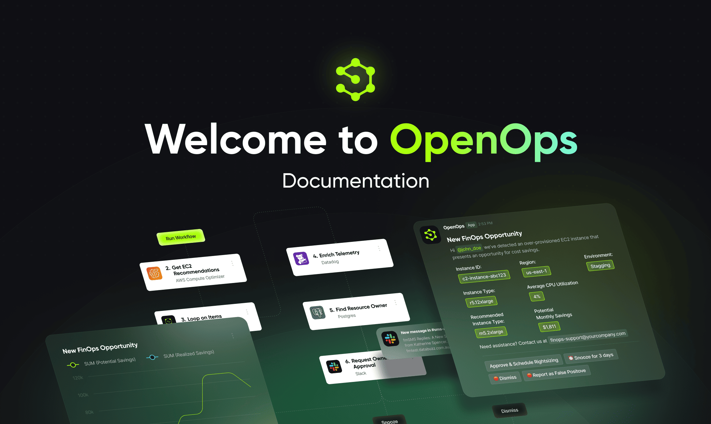

# **OpenOps Documentation**

 
 

## **😎 What is OpenOps?**
[OpenOps](https://openops.com) is a **No-Code FinOps automation platform** that helps organizations reduce cloud costs and streamline financial operations.

## **📚 This is the Documentation Repo**

* For the full documentation website, visit [this link](https://docs.openops.com/).

* If you're looking for the main open source repo that hosts the OpenOps project, visit [this link](https://github.openops.com) instead.

* If you're looking to contribute, we welcome contributions to OpenOps\! See our [contributing guide](https://github.com/openops-cloud/openops/blob/main/CONTRIBUTING.md) for details.

## **📄 License**

OpenOps documentation, much like the OpenOps project itself, are licensed under the **Apache License 2.0**.

## **💬 Community**

OpenOps has a Slack community - feel free to join [here](https://slack.openops.com).

## **📬 Contact**

* Website: [https://openops.com](https://openops.com)
* Slack: [https://slack.openops.com](https://slack.openops.com)
* Email: [support@openops.com](mailto:support@openops.com)
