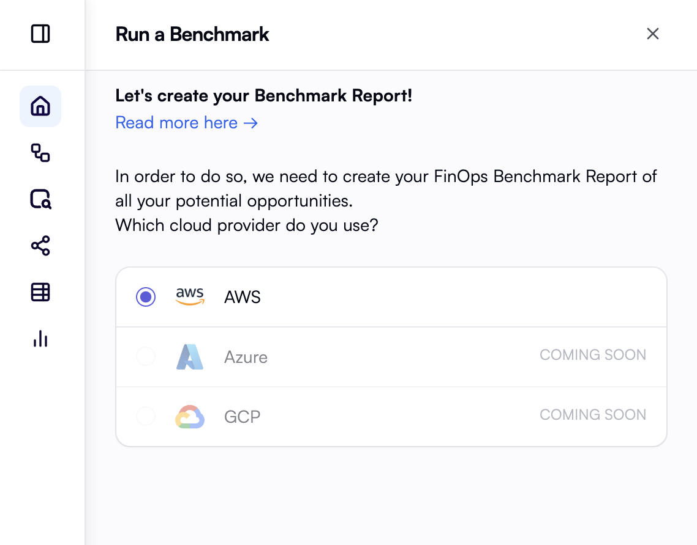
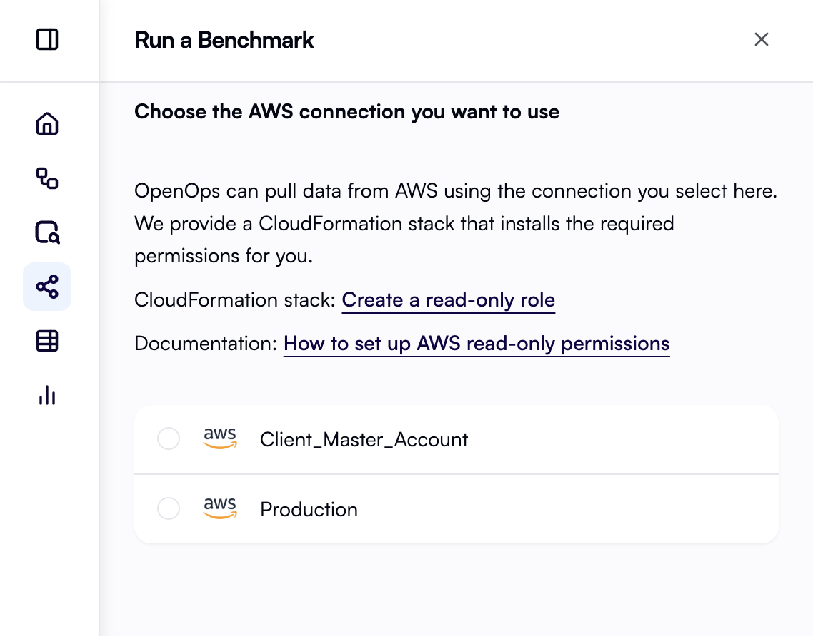
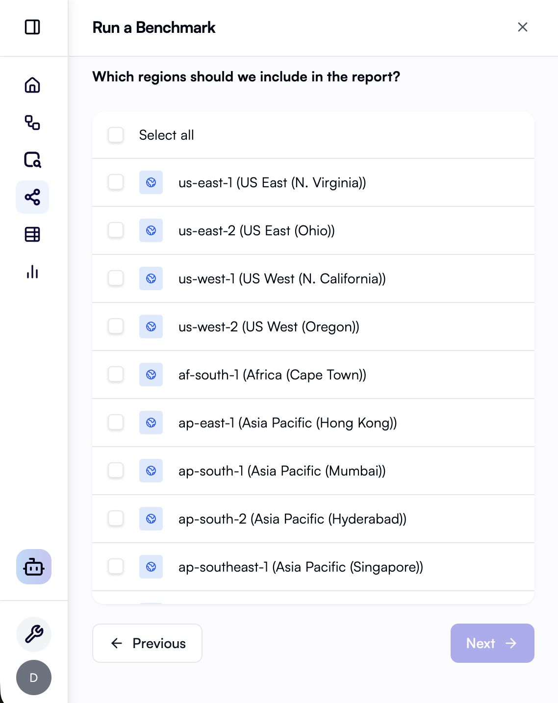
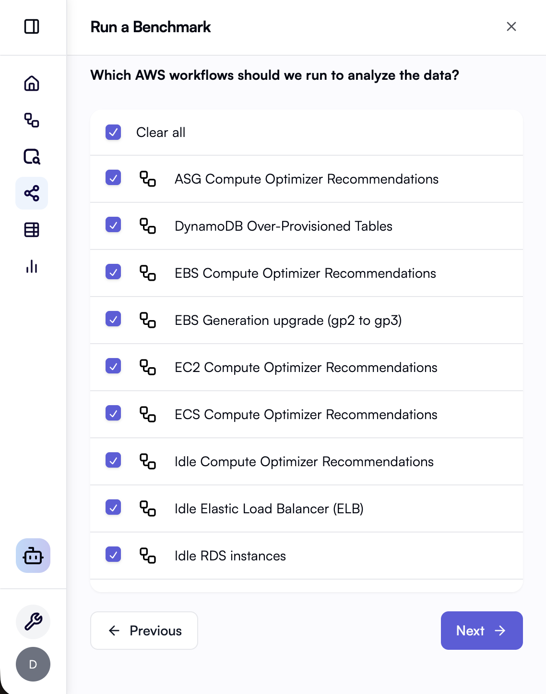

import JoinCommunity from '/snippets/join-community.mdx'

**Benchmark** helps you run a **guided assessment** across the cloud provider you use with OpenOps. You choose your connection, scope, and which cost and efficiency checks to include. OpenOps automatically creates the workflows, runs them, and collects findings so you can prioritize savings and cleanup in one place.

## What you get

* A **library of checks** tuned to your selected provider - for example utilization and waste, rightsizing, and savings across compute, storage, databases, and related services.
* A **benchmark report** in [Analytics](/reporting-analytics/analytics) so you can review KPIs and trends.

## Running a benchmark

1. Click **Run a Benchmark** on the OpenOps home page to start.
2. Select your **cloud provider**. If you have no connection yet, create one when prompted.

3. Choose the **connection** the benchmark should use.

4. Select **accounts or subscriptions** and **regions** to include.

5. Choose the **benchmark workflows** that correspond to the cost and efficiency checks you want this run to perform.

6. Click **Run** to execute the benchmark.
7. When the run completes, open the benchmark report from the link in the wizard.

## Benchmark report

After a successful run, the **benchmark report** is built from benchmark opportunities and cost data from your chosen cloud provider. You will see:

* **Summary metrics**: For example estimated monthly savings from open opportunities, total opportunity count, a **unified cost efficiency** metric (savings versus monthly cost context), and **monthly amortized cost over time**.
* **Top opportunities to address**: A ranked view you can use to focus on the largest items first.
* **Breakdown of savings**: Charts such as savings **by service**, **by region**, and **by account** so you can see where optimization potential clusters.

Charts are **cross-linked**: Choose a service, region, or account in one chart to filter the rest of the dashboard. A short note on the dashboard reminds you that you can filter using those dimensions.

<JoinCommunity />
